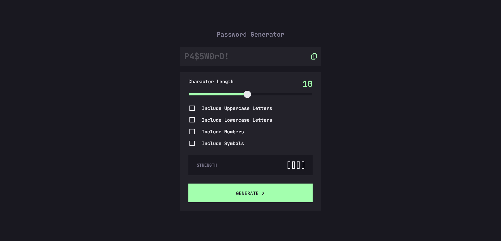
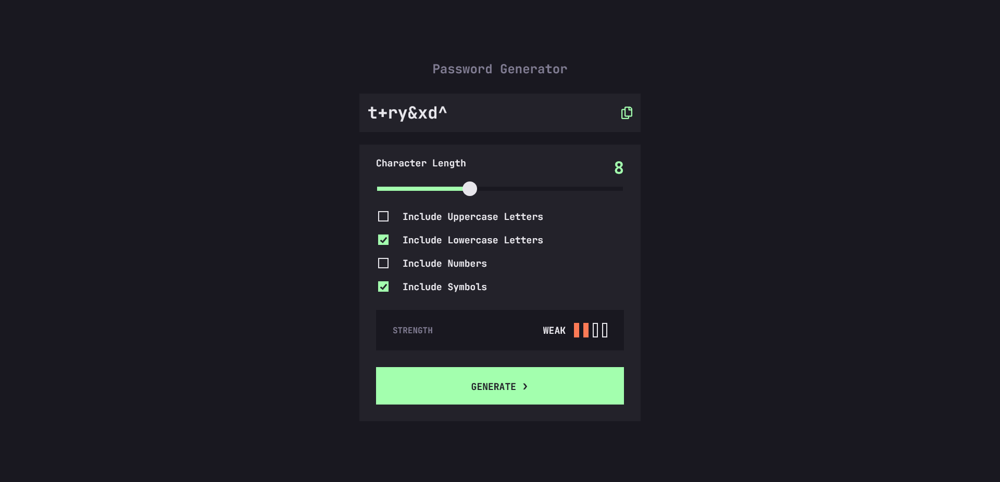
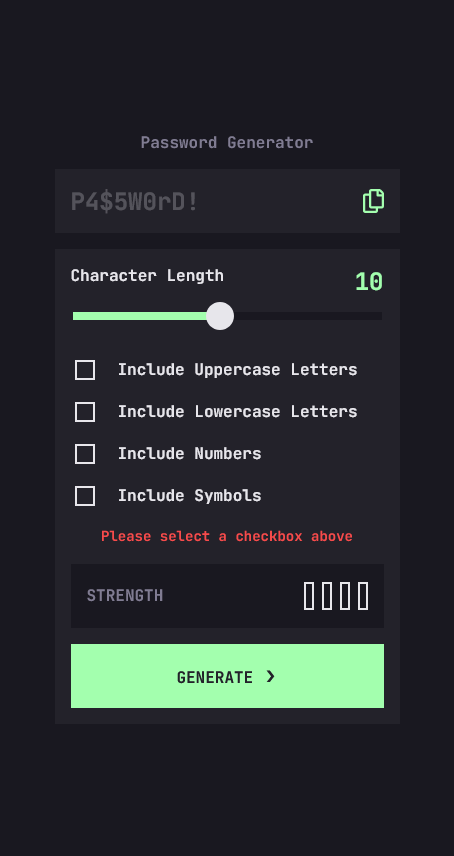

# Frontend Mentor - Password Generator App Solution

This is a solution to the [Password generator app challenge on Frontend Mentor](https://www.frontendmentor.io/challenges/password-generator-app-Mr8CLycqjh).

## Table of contents

- [Overview](#overview)
  - [The challenge](#the-challenge)
  - [Screenshot](#screenshot)
  - [Links](#links)
- [My process](#my-process)
  - [Built with](#built-with)
  - [What I learned](#what-i-learned)
  - [Continued development](#continued-development)
  - [Useful resources](#useful-resources)
- [Author](#author)

## Overview

### The challenge

Users should be able to:

- Generate a password based on the selected inclusion options.
- Copy the generated password to the computer's clipboard.
- See a strength rating for their generated password.
- View the optimal layout for the interface depending on their device's screen size.
- See hover and focus states for all interactive elements on the page.

### Screenshot






### Links

- Solution URL: [GitHub](https://github.com/wesleyjacoby/Password-Generator)
- Live Site URL: [GitHub Pages](https://wesleyjacoby.github.io/Password-Generator/)

## My process

### Built with

- Semantic HTML5 markup
- CSS custom properties
- Flexbox
- Mobile-first workflow
- JavaScript
- zxcvbn (Password Strength Library)


### What I learned

Where do I start! This challenge was way above my skill level, but the app just looked really cool and I couldn't resist trying it out. I thought it would be a great way to practice using JavaScript arrays, but I found the CSS way more challenging!

I learnt that not all browsers are created equally! The app looks good on Chrome, Firefox and Edge now.

Styling the slider was a huge headache, especially getting the background behind the thumb a different color to the background ahead of the thumb. This was the code that got it working:

```js
numberOutput.innerText = slider.value;

slider.oninput = function () {
    numberOutput.textContent = this.value;
}

setBackgroundSize(input);

function setBackgroundSize(input) {
    input.style.setProperty("--background-size", `${getBackgroundSize(input)}%`);
}

input.addEventListener("input", () => setBackgroundSize(input));

function getBackgroundSize(input) {
    const min = +input.min || 1;
    const max = +input.max || 20;
    const value = +input.value;

    const size = (value - min) / (max - min) * 100;

    return size;
}
```

Using the zxcvbn library was a huge help and time saver and made the project more realy world friendly:

```html
<script src="https://cdnjs.cloudflare.com/ajax/libs/zxcvbn/4.2.0/zxcvbn.js"></script>
```

I find myself getting more comfortable using functions as well.

### Continued development

There's obviously still an insane amount to learn, but I'll keep doing more challenges so I can be presented with a multiple of different problems to try solve.

### Useful resources

There's just too many to list here. I spent an entire day trying to style that slider. The code above shows how I finally got it to work.

## Author

- Frontend Mentor - [@wesleyjacoby](https://www.frontendmentor.io/profile/yourusewesleyjacobyrname)